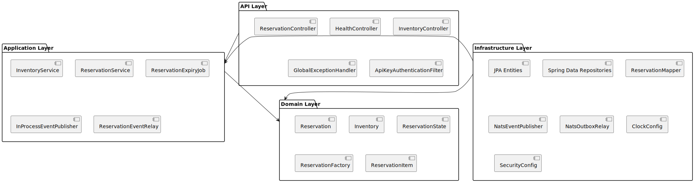
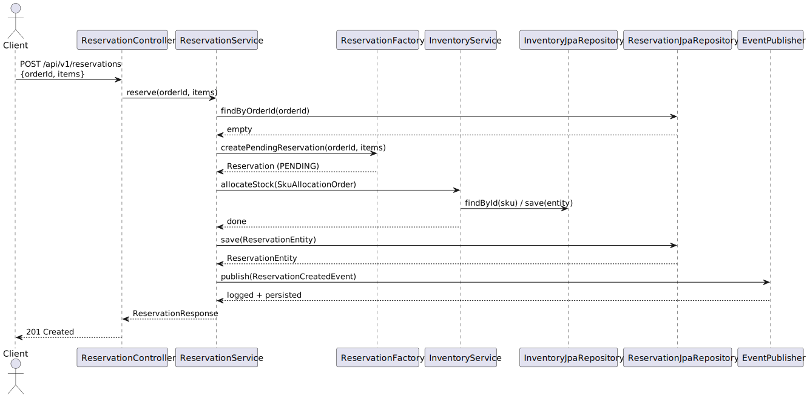
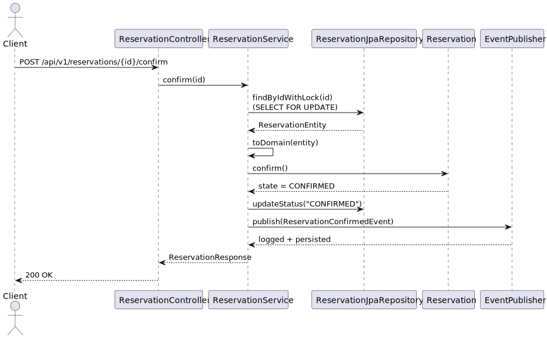
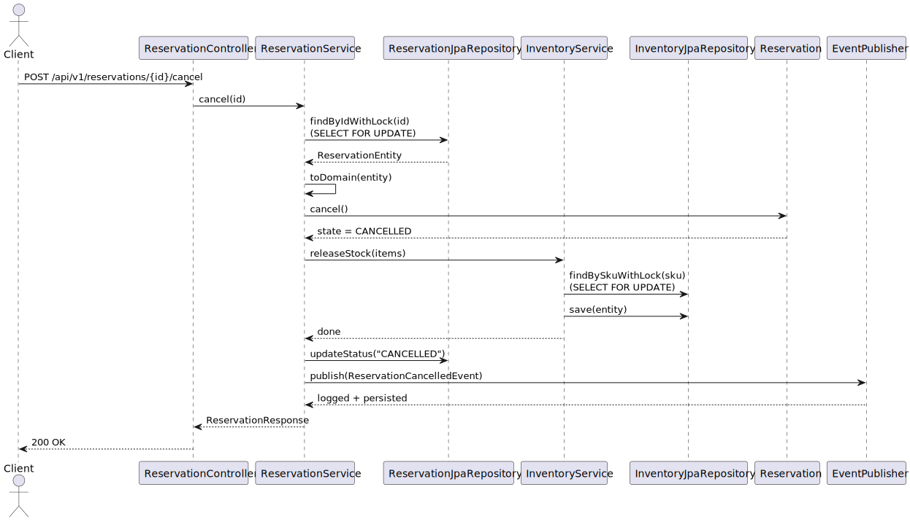
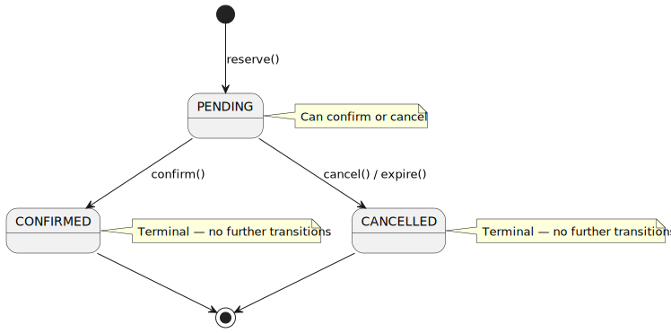
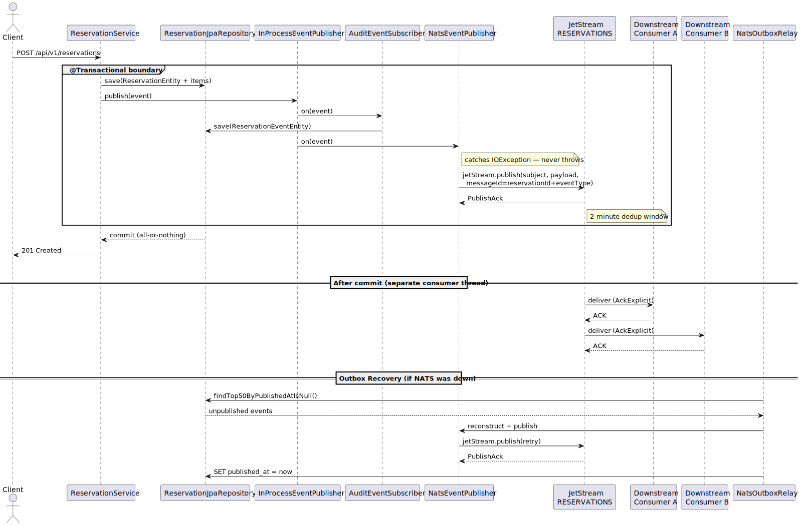
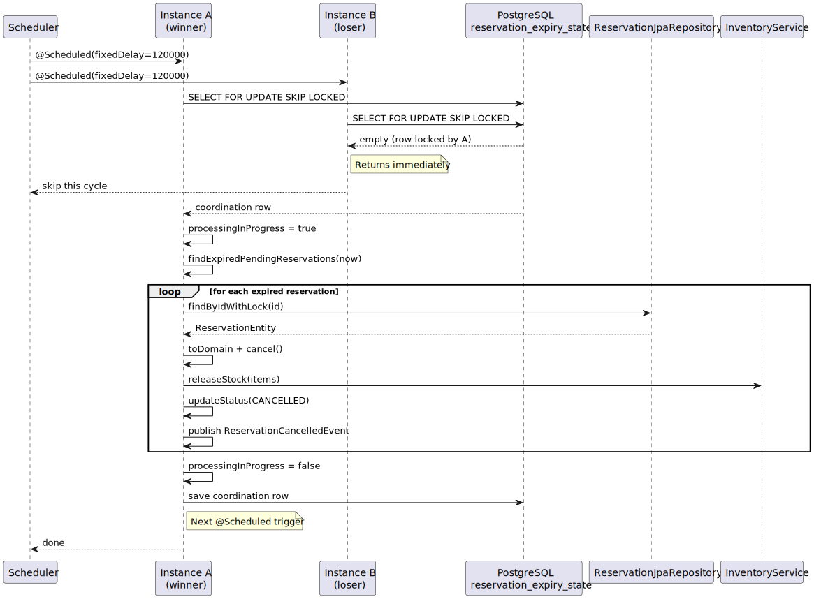

# Warehouse Inventory Reservation Service

**Java 21 · Spring Boot 3.3.4 · PostgreSQL 15 · NATS JetStream · Maven**

A high-throughput warehouse inventory reservation service built around a hybrid locking strategy and a Transactional Outbox event pipeline.

---

## 1. Why This Problem

Warehouse inventory reservation is a deceptively hard problem. The hard constraint is never selling stock you don't have — that's a correctness guarantee, not a performance goal. On top of that, concurrent clients can collide on the same SKU, state transitions can race, and the system has to survive crashes without leaking stock or dropping events.

This problem forces genuine architectural decisions rather than academic ones. The locking strategy matters. The event model matters. The database schema has to enforce invariants the application cannot. It is small enough for one engineer to own end-to-end, but rich enough that every trade-off has visible consequences.

---

## 2. Architecture Overview



The codebase follows a hexagonal layout with four layers and strict one-way dependencies:

```
com.wirs.inventory.reservation/
├── api/           Inbound HTTP adapters — controllers, DTOs, security, error handling
├── application/   Use-case orchestration — services, expiry job, event pipeline
├── domain/        Business logic — model, state machine, factory, events, exceptions
└── infrastructure/ Outbound adapters — JPA, repos, Spring config, NATS messaging
```

**Layer rules (zero exceptions):**
- `api/` → `application/` only
- `application/` → `domain/` only (via interfaces)
- `domain/` imports nothing from Spring or JPA. Not `@Entity`, not `@Service`, not `@Repository`
- `infrastructure/` → `application/` interfaces + `domain/` model

This is not ideology. The concrete payoff: domain unit tests run in milliseconds with no Spring context. A test for `PendingState.confirm()` tests only the state logic.

**Why the boundaries are where they are.** The domain owns the business rules — state transitions, stock invariants, factory logic. The application layer orchestrates use cases without knowing about databases or HTTP. The API layer handles serialization, validation, and auth. The infrastructure layer bridges to PostgreSQL, NATS, and the scheduler. Each layer has exactly one reason to change.

**Read paths bypass the domain model.** Write paths (create, confirm, cancel, expire) construct domain objects because they need state machine logic. Read paths (`getReservation`, `listReservations`, `getInventory`) return data directly, skipping the entity-to-domain-to-DTO double-mapping on the majority of request volume. There is no point paying an abstraction tax where no behavior is needed.

**Virtual threads** are enabled (`spring.threads.virtual.enabled: true`). Tomcat and HikariCP delegate to the virtual thread executor, so blocked I/O parks a virtual thread instead of holding an OS thread. This improves throughput under connection-bound workloads at no cost to the existing concurrency model.

### Request Flows

**Reservation creation (happy path):**



**Confirm flow:**



**Cancel flow (with stock release):**



---

## 3. Framework Choice — Spring Boot

Spring Boot 3.3.x over Quarkus. The reasoning is practical.

Spring Data JPA's `@Version` and `@Lock(PESSIMISTIC_WRITE)` integrate directly with the hybrid locking strategy this problem needs. Spring Security's filter chain provides a clean hook for API key validation. Spring Retry's `@Retryable` with jittered backoff is production-grade retry in one annotation. `@Scheduled` with `fixedDelay` handles the expiry job predictably. Virtual thread support is a first-class toggle since Spring Boot 3.2.

Quarkus excels at native compilation and sub-100ms startup — neither is a primary concern for a long-running warehouse service. If this needed to cold-start in a serverless context, Quarkus would win. It does not. Spring Boot's broader ecosystem, mature AOT, and team familiarity make it the pragmatic choice.

---

## 4. Design Patterns

**State Pattern** — `com.wirs.inventory.reservation.domain.state.*`

`Reservation.confirm()` is three lines: call `state.confirm()`, assign the result, update the timestamp. No `if (status == PENDING)` anywhere. `PendingState` knows it can confirm. `ConfirmedState` knows it cannot. The rule lives in the state object, not scattered across conditionals. Adding a fourth state requires one new class and zero changes to existing state classes or the aggregate.



**Factory Pattern** — `com.wirs.inventory.reservation.domain.factory.ReservationFactory`

Reservation construction involves: validating items are non-empty, generating a UUID, computing `expiresAt = now + expiryMinutes`, and setting the initial `PendingState`. The factory owns all of that. The service receives a validated domain object ready for persistence. The factory injects a `Clock` for deterministic time in tests — no `Instant.now()` calls hidden in production code.

**Observer Pattern** — `com.wirs.inventory.reservation.application.event.*`

`ReservationService` calls `eventPublisher.publish(event)` and moves on. It does not know about `AuditEventSubscriber`, `StructuredLogSubscriber`, or `NatsEventPublisher`. Adding a new subscriber means writing one class that implements `DomainEventSubscriber`. Zero changes to the service or existing subscribers. `InProcessEventPublisher` fans out via Spring's `List<DomainEventSubscriber>` injection.

**Value Objects for Lock Ordering** — `SkuAllocationOrder` and `OrderedIdList` are typed wrappers whose only public constructors sort their contents deterministically. `InventoryService.allocateStock()` accepts only `SkuAllocationOrder` — passing an unsorted list does not compile. The deadlock prevention strategy is enforced at the type level.

---

## 5. SOLID Principles

**Single Responsibility.** `ReservationService` orchestrates the workflow. It does not compute expiry times (that is `ReservationFactory`), manipulate stock numbers (that is `InventoryService`), map exceptions to HTTP codes (that is `GlobalExceptionHandler`), or validate API keys (that is `ApiKeyAuthenticationFilter`). `InventoryService` allocates and releases stock but does not know what a reservation is — it works with `SkuAllocationOrder` and `InventoryEntity`. `HealthController` handles HTTP for health checks but delegates the database probe to `HealthService`. Each class has exactly one axis of change.

**Open/Closed.** The event subscriber system is the textbook example. `ReservationService` calls `eventPublisher.publish()` and never changes when new subscribers appear. `InProcessEventPublisher` iterates a `List<DomainEventSubscriber>` — adding `NatsEventPublisher` for Advanced Track A means writing one class that implements `DomainEventSubscriber`. `InProcessEventPublisher` does not change. `ReservationService` does not change. No existing code is touched. The same principle applies to the state machine: adding a fourth state means one new class extending `ReservationState`. No switch statements, no existing state classes modified.

**Liskov Substitution.** The `ReservationState` hierarchy (`PendingState`, `ConfirmedState`, `CancelledState`) is a direct application. Each subclass overrides `confirm()` and `cancel()` with the behavior appropriate to that state. A caller holding a `ReservationState` reference — for example `Reservation.confirm()` which calls `this.state.confirm()` — works identically regardless of which concrete state `state` points to. `PendingState.confirm()` returns a `ConfirmedState`. `ConfirmedState.confirm()` throws `InvalidStateTransitionException`. Both honour the contract defined by the abstract class. No caller ever needs to check `instanceof`.

**Interface Segregation.** The event system has three separate interfaces: `DomainEvent` (3 methods — `aggregateId()`, `occurredAt()`, `eventType()`), `EventPublisher` (1 method — `publish(DomainEvent)`), and `DomainEventSubscriber` (1 method — `on(DomainEvent)`). A class that only publishes events implements `EventPublisher` without being forced to implement subscriber logic. A class that only subscribes implements `DomainEventSubscriber`. The `ReservationCreatedEvent` record implements `DomainEvent` with 5 fields, while `ReservationConfirmedEvent` has only 3 — neither carries methods the other needs. No kitchen-sink interface.

**Dependency Inversion.** `ReservationService` depends on `EventPublisher` (an interface), not on `InProcessEventPublisher` (the concrete implementation). At test time, a mock `EventPublisher` is injected. At runtime, Spring injects the real `InProcessEventPublisher`. The same applies to `ReservationService` depending on `InventoryService` through its interface, and `InventoryService` depending on `InventoryJpaRepository` (Spring Data interface, not a concrete class). High-level orchestration never depends on low-level infrastructure choices.

---

## 6. Database Design

Six tables managed through Liquibase SQL changesets:

| Table | Key Columns | Rationale |
|-------|-------------|-----------|
| `products` | `sku VARCHAR(50) PK` | Static catalog, referential integrity anchor |
| `inventory` | `total_stock BIGINT`, `available_stock BIGINT`, `reserved_stock BIGINT`, `version BIGINT` | `BIGINT` because warehouse quantities exceed INT range; `CHECK (total_stock = available_stock + reserved_stock)` enforces the stock invariant at the database level as a safety net |
| `reservations` | `id UUID PK`, `order_id VARCHAR(100) UNIQUE`, `status VARCHAR(20)`, `expires_at TIMESTAMP` | UUIDs do not expose sequential IDs; the unique constraint on `order_id` is the atomic idempotency guarantee |
| `reservation_items` | `reservation_id UUID FK`, `sku VARCHAR(50) FK`, `quantity BIGINT` | Value objects with no identity; composite key prevents duplicate SKU entries per reservation |
| `reservation_events` | `id UUID PK`, `payload JSONB`, `published_at TIMESTAMP NULL` | JSONB allows evolving event structure without schema migrations; nullable `published_at` is the outbox flag |
| `reservation_expiry_state` | `id INT CHECK (id = 1)`, `processing_in_progress BOOLEAN` | Single-row coordination table; pessimistic locking, not `@Version` |

**Key indexes:**
- `idx_reservations_status_expiry` — partial index on `(status, expires_at) WHERE status = 'PENDING'`. Used exclusively by the expiry job. Stays small by excluding terminal states.
- `idx_reservation_events_unpublished` — partial index on `(created_at) WHERE published_at IS NULL`. Keeps the outbox relay query fast as the table grows.

**Partitioning.** `reservation_events` is partitioned by day (`RANGE (created_at)`). At 10,000 reservations/minute, the table accumulates ~14.4M rows per day. Dropping old partitions is a metadata operation, not a delete storm. Published events older than 7 days are cleaned up by a weekly batch delete.

---

## 7. Concurrency Strategy

Two concurrency problems, two different solutions.

**Inventory allocation uses optimistic locking** (`@Version` on `InventoryEntity` + `@Retryable` with jittered backoff). Contention per SKU is rare — most requests target different SKUs. Reads proceed freely; conflicts only happen at the update boundary. The retry uses `@Backoff(delay = 100, multiplier = 2, maxDelay = 1000, random = true)`. The jitter is critical: without it, 500 retrying threads all wake up at 100ms simultaneously and collide again.

**State transitions use pessimistic locking** (`@Lock(PESSIMISTIC_WRITE)` → `SELECT ... FOR UPDATE`). A PENDING reservation has high collision probability — the same reservation can be confirmed or cancelled concurrently. With optimistic locking, retry semantics would be ambiguous (should a confirm retry after a concurrent cancel?). The answer is "read the current state and decide," which is exactly what `SELECT FOR UPDATE` gives you. Deterministic, fail-fast, no retry loop.

**Multi-SKU deadlock prevention.** `SkuAllocationOrder` sorts items by SKU before constructing the record. `InventoryService.allocateStock()` accepts only this type — passing an unsorted list does not compile. Lock acquisition order is enforced at the type level, not by convention.

**Multi-SKU partial failure.** If a reservation targets SKU A (available) and SKU B (insufficient), the entire transaction rolls back. `@Transactional` guarantees SKU A's allocation reverts. No partial allocation.

---

## 8. Idempotency

Two-layer guarantee for `POST /api/v1/reservations`:

1. **Application check:** Before attempting creation, the service queries `findByOrderId()`. If a reservation exists, it returns HTTP 200 with the existing reservation — the caller gets the same response as if their request had succeeded.

2. **Database constraint:** Two concurrent requests with the same `orderId` may both pass the application check (neither has committed yet). The `UNIQUE (order_id)` constraint means only one INSERT succeeds. The other gets a `DataIntegrityViolationException`, which the service catches, re-reads the winning reservation, and returns as HTTP 200.

The constraint is atomic at the database level — no advisory locks, no `SELECT FOR UPDATE` on a non-existent row, no gap-lock complexity. HTTP 200 for duplicates (not 409) because returning an error on a successful retry is misleading — the operation worked, nothing new was created.

---

## 9. Event Design

Events are domain records (`ReservationCreatedEvent`, `ReservationConfirmedEvent`, `ReservationCancelledEvent`) implementing the `DomainEvent` interface. Each carries the aggregate ID, timestamp, and a type-specific payload.

**Transactional Outbox.** Every event is written to `reservation_events` in the same database transaction as the state change. If the commit succeeds, the event is durable. If the application crashes between the commit and the in-process dispatch, the event sits in the table with `published_at = NULL`.

Two relay components ensure delivery:

- **`ReservationEventRelay`** (always active) polls every 30 seconds for events with `published_at IS NULL`, deserializes them, and dispatches through `InProcessEventPublisher`. This is the core durability backstop.

- **`NatsOutboxRelay`** (conditionally active, `app.nats.enabled=true`) performs the same poll but delivers events to JetStream via `NatsEventPublisher`, bypassing the in-process subscriber chain. This handles crashes where a NATS publish succeeded but the `published_at` update was not committed.

### Advanced Track A — NATS JetStream

When `app.nats.enabled=true`, `NatsEventPublisher` joins the subscriber chain. The diagram below shows the end-to-end event flow from HTTP request to downstream consumers:



**Subject mapping:**

| Event | Subject |
|-------|---------|
| `ReservationCreatedEvent` | `reservations.created` |
| `ReservationConfirmedEvent` | `reservations.confirmed` |
| `ReservationCancelledEvent` | `reservations.cancelled` |

**Stream configuration:** The `RESERVATIONS` stream is file-backed (survives restarts), retains messages for 7 days (up to 10 GB), uses `DiscardPolicy.New`, and has a 2-minute server-side deduplication window via `messageId`. Created by `NatsStreamInitializer` on startup.

**Consumer design (downstream services):** Two durable consumer groups are expected on the consuming side:
- `wirs-order-mgmt` — subscribes to `reservations.created` and `reservations.cancelled` with `AckExplicit`, 30s `ackWait`, max 5 redeliveries
- `wirs-analytics` — subscribes to all subjects with 60s `ackWait`, max 10 redeliveries

Both use `DeliverAll` policy so they receive messages missed during downtime. These consumers are not part of this service; they belong to the downstream applications that consume reservation events.

**Ack strategy:** `PublishAck` from JetStream confirms server-side persistence. If the ACK does not arrive within the timeout, the relay retries with the same `messageId`; JetStream deduplicates within the 2-minute window. Consumers use `AckExplicit` — messages are removed only after explicit acknowledgment.

**NATS unavailable:** `NatsEventPublisher.on()` catches `IOException` and logs a warning — it does not throw. The event remains in `reservation_events` with `published_at = NULL`. `NatsOutboxRelay` redelivers once NATS recovers. Events cannot be lost because they were persisted before the NATS publish was attempted.

---

## 10. Redis Design (Not Implemented)

This track is designed in `ARCHITECTURE.md` but not implemented in the current codebase.

The design calls for:
- **Read-through cache** on `inventory:sku:{sku}` with 30-second TTL, invalidated on write via `redisTemplate.delete()`. Falls back to PostgreSQL on Redis outage.
- **Distributed lock** for expiry via Redisson `RLock` with 90-second TTL. Wait timeout of 0 — skip immediately if held. Falls back to the database coordination table if Redis is unavailable.

This was not implemented because the database-only approach is sufficient for the expected deployment scale (2–10 instances). Redis adds infrastructure complexity without a concrete benefit at this sizing. The design is documented for when the need arises.

---

## 11. Expiry Job Design

`ReservationExpiryJob` runs every 2 minutes (`@Scheduled(fixedDelay = 120_000)` — not cron, because `fixedDelay` naturally staggers instances that finish at different times).

**Multi-instance coordination:** A single-row table `reservation_expiry_state` with a `processing_in_progress` flag. Multiple service instances race to acquire the row lock via `SELECT ... FOR UPDATE SKIP LOCKED`. Only the winner proceeds; all others return in microseconds.



**Stuck-job detection:** If `processing_in_progress = TRUE` and `last_expiry_run` is more than 5 minutes old, the flag is considered stale (the previous instance crashed) and the job overrides it. No manual intervention required.

**Per-reservation error isolation:** A `try/catch` wraps each individual reservation. If reservation R1 fails (e.g., a concurrent API confirm completed between the scan and the lock), the job logs and moves to R2. One failure does not abort the batch.

**No batching on the initial query.** The job loads all expired reservations at once via `findExpiredPendingReservations()`. For the expected scale (thousands, not millions) this is acceptable. If the backlog grows beyond 50,000 rows, the list would consume significant heap and the job should be refactored to use pagination or a cursor.

---

## 12. Security

API key authentication via `ApiKeyAuthenticationFilter` (extends `OncePerRequestFilter`). The filter extracts the `X-API-Key` header, validates it against a comma-separated list of valid keys from `app.security.api-keys`, and either sets an `Authentication` object in `SecurityContextHolder` or writes a 401 response directly.

Multiple keys are supported by design — rotating keys in production requires adding the new key before removing the old one, enabling zero-downtime key rotation.

All paths except `/health`, `/swagger-ui.html`, and `/v3/api-docs/**` require authentication.

---

## 13. How to Run

### Prerequisites
- Java 21+ (only if running outside Docker)
- Docker Desktop 4.x or Docker Engine 24+ with Compose V2

```bash
# Core Track (PostgreSQL only)
docker compose up

# API at http://localhost:8080
# Swagger UI at http://localhost:8080/swagger-ui.html

# Advanced Track A (PostgreSQL + NATS JetStream)
docker compose -f docker-compose.yml -f docker-compose.nats.yml up

# NATS monitoring at http://localhost:8222
```

### Configuration

| Variable | Default | Purpose |
|----------|---------|---------|
| `SPRING_DATASOURCE_URL` | `jdbc:postgresql://localhost:5433/inventory_db` | JDBC URL (5433 avoids local Postgres conflicts) |
| `SPRING_DATASOURCE_USERNAME` | `app_user` | Database user |
| `SPRING_DATASOURCE_PASSWORD` | `secure_dev_password` | Database password |
| `API_KEYS` | `dev-key-12345` | Comma-separated valid API keys |
| `NATS_ENABLED` | `false` | Enable NATS JetStream |
| `NATS_URL` | `nats://localhost:4222` | NATS server URL |

Liquibase runs automatically on startup. No manual schema setup needed.

### Docker image

```bash
java -XX:+UseZGC -Xms512m -Xmx1g -jar app.jar
```

ZGC provides sub-millisecond GC pauses at the allocation rates this workload generates. 1 GB heap is sufficient for development; production deployments should tune based on profiling.

### Management endpoints

| Endpoint | URL | Auth |
|----------|-----|------|
| Health check | `/health` | Public |
| Actuator health | `/actuator/health` | Required |
| Prometheus scrape | `/actuator/prometheus` | Required |

---

## 14. How to Run Tests

Integration tests use Testcontainers for PostgreSQL and require Docker.

```bash
# Unit tests — no Docker, no Spring context for domain tests
./mvnw test -Dgroups=unit

# Integration tests — full Spring context with Testcontainers (requires Docker)
./mvnw test -Dgroups=integration

# All tests
./mvnw test -Dgroups=unit,integration

# Full pipeline: compile → all tests → JaCoCo coverage check (70% instruction minimum)
./mvnw verify
```

### Test Inventory

**Unit tests (33+ classes, no Docker/Spring context):**

| Package | Focus |
|---------|-------|
| `domain` | State machine transitions, stock invariants, factory validation, value object ordering |
| `api` | Auth filter, request validation, controller mapping, exception-to-HTTP, DTO construction |
| `application` | Service orchestration, expiry job logic, event fan-out, relay deserialization |
| `infrastructure` | NATS config, stream initializer, outbox relay, event publisher, entity construction |

**Integration tests (4 classes, Testcontainers PostgreSQL):**

| Test class | Scenarios |
|-----------|-----------|
| `ReservationLifecycleIntegrationTest` | Create→Confirm, Create→Cancel with stock restoration, duplicate orderId (200), invalid transition (409), insufficient stock (409), expiry, security, health |
| `ConcurrentReservationIntegrationTest` | Two threads racing on the same SKU, same orderId, same reservation — exactly one wins each |
| `OutboxRelayIntegrationTest` | Relay marks published events, unknown types are skipped |
| `LiquibaseMigrationIntegrationTest` | All six tables present, seed data present |

**Coverage target:** 70% instruction coverage (JaCoCo). The floor reflects deliberate exclusions: infrastructure wiring, Lombok-generated code, and conditional NATS beans.

---

## 15. Trade-offs

**No full Event Sourcing.** The `reservation_events` table is an audit log, not an event store for state reconstruction. Full event sourcing would require snapshot management, schema versioning, and projection rebuild performance optimization — real operational overhead for a system where the primary need is an audit trail and downstream delivery. The outbox gives us both without the complexity. The trade-off: we cannot rewind state or rebuild projections from scratch without data loss of terminal states.

**Synchronous event publishing in-core.** In-process subscribers run synchronously within the transaction. A slow subscriber (e.g., a blocked NATS connection) delays the HTTP response. In production, the NATS publisher should use a bounded async queue. For the core track, this is acceptable because the subscribers do local work (DB writes and logging). The risk: a subscriber throwing an uncaught exception could roll back the transaction. This is mitigated by wrapping subscriber calls in try/catch at the publisher level.

**Database-only expiry coordination.** `SELECT FOR UPDATE SKIP LOCKED` on a single coordination row works correctly for 2–10 instances. Beyond that, row-level contention on the coordination row becomes measurable. The Redis distributed lock (Advanced Track B) is the right answer at larger scale. For the expected deployment size, the database approach is simpler and has one fewer infrastructure dependency.

**No circuit breaker for database calls.** If PostgreSQL becomes degraded, the application has no mechanism to shed load gracefully. A Resilience4j `CircuitBreaker` wrapping database operations would allow the service to fail fast with a 503 instead of exhausting the connection pool. This is production-necessary but was outside the core track scope.

**Read paths bypass the domain model.** This creates an asymmetry: write paths use domain objects, read paths return data directly. A write followed by an immediate read returns data that was never validated by the domain model on the read side. In practice, the data was validated at write time and stored in the same database — the risk is minimal. The benefit is avoiding entity-to-domain-to-DTO double-mapping on 90%+ of request volume.

---

## 16. What Breaks at 10,000 Concurrent Requests Per Minute

167 requests per second. Here is the ordered failure cascade:

**First — HikariCP connection pool exhaustion.** Little's Law: 167 RPS × 200ms average DB operation = 33 connections steady-state. But warehouse workloads arrive in bursts — a WES releasing 500 pick orders simultaneously drives instantaneous demand far higher. Pool size of 50 covers burst headroom, but sustained bursts exceeding that cause threads to queue. With `connection-timeout = 20,000ms`, they wait up to 20 seconds before failing with a 503. The failure mode is HTTP 503 responses with `HikariPool-1 - Connection is not available, request timed out` in logs. The fix: reduce `connection-timeout` to 2,000ms so threads shed load fast rather than stacking up. Monitor `hikaricp.connections.usage` and alert above 80% sustained.

**Second — optimistic lock contention on hot SKUs.** If the burst concentrates on 2–3 popular SKUs, version-column retries climb. Each retry takes 100–400ms with jittered backoff. At 500+ concurrent requests on a single SKU, the retry pool becomes a latency amplifier. The failure mode is threads burning all three retry attempts, with `ObjectOptimisticLockingFailureException` in logs. Clients receive 409 INSUFFICIENT_STOCK even when stock exists — because the retries all failed before the last update could commit. The fix: monitor `reservation.stock.optimistic_lock_retries` and alert above 20% retry rate. The structural fix is Redis DECR-based atomic stock (Advanced Track B), which eliminates version-column races entirely.

**Third — expiry job I/O after recovery.** If the service is down for 30 minutes, it comes back to potentially 50,000 expired reservations. Each reservation requires a lock, state update, inventory release (N SKUs), and event insert. At ~50/second processing rate, the backlog takes ~16 minutes to clear. During this period, the expiry job competes with live traffic for the connection pool. The job currently loads all expired reservations at once — at 50,000 rows this consumes ~50 MB of heap for the entity list. If this becomes problematic, the query should be refactored to use pagination.

**What stays stable:** Virtual threads handle Tomcat's concurrency without OS thread exhaustion. PostgreSQL MVCC with row-level locking scales to thousands of concurrent readers. The partial indexes on `reservation_events` and `reservations` remain efficient at this volume. The database itself is not the first failure point.
PENDING → CANCELLED  (automatic — TTL expiry job, triggeredBy = EXPIRY_JOB)
```

### Response Envelope

All responses use a consistent `{ data, error }` envelope:

```json
{
  "data": { "reservationId": "...", "orderId": "ORD-1001", "status": "PENDING" },
  "error": null
}
```

```json
{
  "data": null,
  "error": {
    "code": "INSUFFICIENT_STOCK",
    "message": "SKU A100 has only 30 units available; 50 were requested"
  }
}
```

### Example requests

**Create a reservation:**
```bash
curl -s -X POST http://localhost:8080/api/v1/reservations \
  -H "Content-Type: application/json" \
  -H "X-API-Key: dev-key-12345" \
  -d '{
    "orderId": "ORD-1001",
    "items": [
      { "sku": "A100", "quantity": 10 },
      { "sku": "B200", "quantity": 5 }
    ]
  }'
```

**Confirm a reservation:**
```bash
curl -s -X POST http://localhost:8080/api/v1/reservations/{id}/confirm \
  -H "X-API-Key: dev-key-12345"
```

**Cancel a reservation:**
```bash
curl -s -X POST http://localhost:8080/api/v1/reservations/{id}/cancel \
  -H "X-API-Key: dev-key-12345"
```

**Get stock levels:**
```bash
curl -s http://localhost:8080/api/v1/inventory/A100 \
  -H "X-API-Key: dev-key-12345"
```

**Expected successful create response (HTTP 201):**
```json
{
  "data": {
    "id": "550e8400-e29b-41d4-a716-446655440000",
    "orderId": "ORD-1001",
    "status": "PENDING",
    "items": [
      { "sku": "A100", "quantity": 10 },
      { "sku": "B200", "quantity": 5 }
    ],
    "expiresAt": "2025-01-01T10:10:00Z",
    "createdAt": "2025-01-01T10:00:00Z"
  },
  "error": null
}
```
